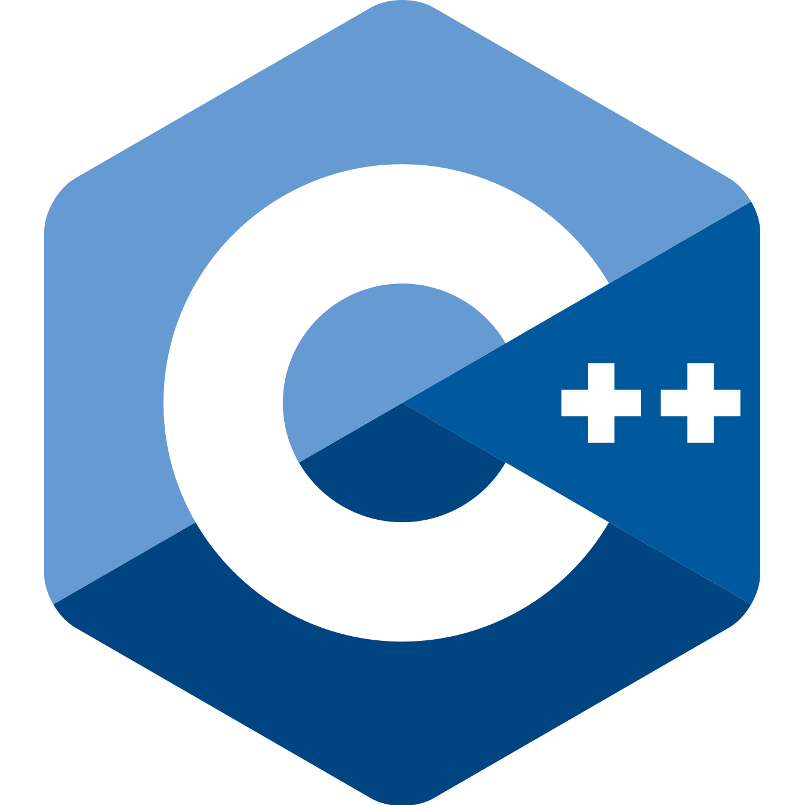
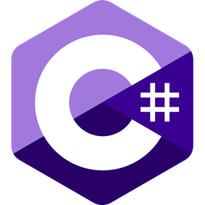

### Hey There! I'm Jordan Schneider👋

...a student at University of Central Florida studying for a major in Computer Engineering and a minor in Mathematics

 

- 🔭 I’m currently working on schoolwork, but hopefully my portfolio soon enough ;)
- 🌱 I'm also currently working on doing some more 3D modeling for enjoyment
- 👯 I’m looking to learn python, at some point :(

#### What Languages do I use?
 
<code></code>
<code></code>
<code></code>
<code></code>
<code></code>
<code></code>

#### What Technologies do I use?
 
<code></code>
<code></code>
<code></code>
<code></code>
<code></code>

 
 
 

